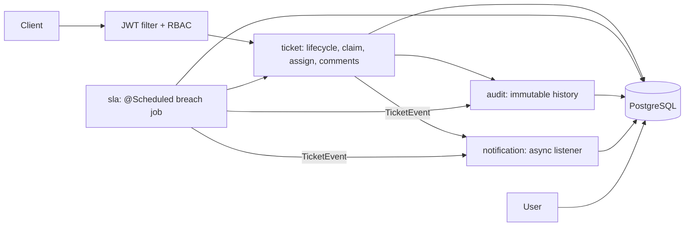

# ServiceDesk

A ServiceNow-style ITSM backend: requesters submit tickets, agents work them, managers configure SLAs, and every change is audited and escalated automatically.

**Stack:** Java 17, Spring Boot 3.2, Spring Security + JWT, PostgreSQL + Spring Data JPA, springdoc-openapi, JUnit 5 + Testcontainers, Docker Compose.

## Run it

```bash
docker compose up --build        # Postgres + app
# or: docker compose up -d postgres && mvn spring-boot:run
```

- Swagger UI: http://localhost:8080/swagger-ui.html
- Seeded admin: `admin@servicedesk.local` / `admin12345` (override with `ADMIN_EMAIL` / `ADMIN_PASSWORD`)
- Seeded teams: *Service Desk*, *Network*; seeded SLA policies for every priority

Tests: `mvn test` (needs Docker for Testcontainers). Unit tests only: `mvn test -Dtest=TicketStatusTest`.

## Architecture



```
com.servicedesk
 ├── ticket/        Ticket, TicketStatus (state machine), TicketService, Comment
 ├── sla/           SlaPolicy, SlaService (cached policies, escalation), SlaBreachJob
 ├── user/          User, Team, Role, JWT auth, security config
 ├── audit/         TicketStatusHistory (@Immutable), AuditService
 ├── notification/  TicketEvent, @Async listener, Notification
 └── common/        ApiException, GlobalExceptionHandler, OpenAPI config, DataSeeder
```

## Quick walkthrough

1. `POST /api/auth/login` as admin, then `POST /api/users` to create an `AGENT` (with a `teamId`) and a `MANAGER`.
2. `POST /api/auth/register` as a requester, then `POST /api/tickets` with a `teamId`. It is auto-routed to the least-busy agent on that team.
3. As the agent: `POST /api/tickets/{id}/status` `{"status":"IN_PROGRESS"}`, then `RESOLVED`. The requester closes it with `CLOSED`.
4. `GET /api/tickets/{id}/history` shows the full audit trail; `GET /api/notifications` shows what each user was told.

| Area | Endpoints |
|---|---|
| Auth | `POST /api/auth/register`, `POST /api/auth/login` |
| Users/Teams | `GET /api/users/me`, `GET/POST /api/users` (admin), `GET/POST /api/teams` |
| Tickets | `POST/GET /api/tickets`, `GET /{id}`, `POST /{id}/claim`, `/assign`, `/status`, `/comments`, `GET /{id}/history` |
| SLA | `GET /api/sla-policies`, `PUT /api/sla-policies/{priority}` (manager/admin) |
| Notifications | `GET /api/notifications` |

## Design decisions

- **State machine in the enum.** `TicketStatus.canTransitionTo` is the single source of truth; `NEW -> CLOSED` is rejected with a 400. Per-role rules (who may trigger which transition) sit on top in `TicketService`.
- **Optimistic locking for claims.** `Ticket` has a `@Version` column. If two agents claim the same ticket concurrently, one UPDATE matches zero rows and fails, which is returned as HTTP 409. A Testcontainers test races two threads and asserts exactly one winner. This is the same idea as preventing duplicate execution of an order in a trading system.
- **Immutable audit trail.** `TicketStatusHistory` is `@Immutable` with no setters, written via `Propagation.MANDATORY` so it commits atomically with the change it records. For stronger guarantees, revoke `UPDATE`/`DELETE` on that table for the app's DB role.
- **Async notifications decoupled by events.** Services publish a `TicketEvent`; the listener runs `@Async` on `AFTER_COMMIT`, so a notification failure can never roll back a ticket change, and a rolled-back change never sends a notification. Swapping in RabbitMQ only touches the listener/publisher.
- **SLA engine.** Policies map priority to response/resolution minutes and are cached (in-memory; point Spring's cache at Redis to share across instances). A `@Scheduled` job escalates overdue tickets once: it sets `escalated`, bumps priority one level, writes an audit row (actor = system) and notifies requester, agent and managers. `ON_HOLD` pauses the clock.
- **Team-scoped RBAC.** Requesters see their own tickets, agents see tickets assigned to them or in their team, managers/admins see everything. Self-registration only creates requesters; elevated roles are admin-created.

## Stretch goals

Redis-backed cache, RabbitMQ for notifications, Flyway migrations (replace `ddl-auto: update`), refresh tokens, response-SLA breach alerts, pagination/filtering on ticket lists, a small React UI.
